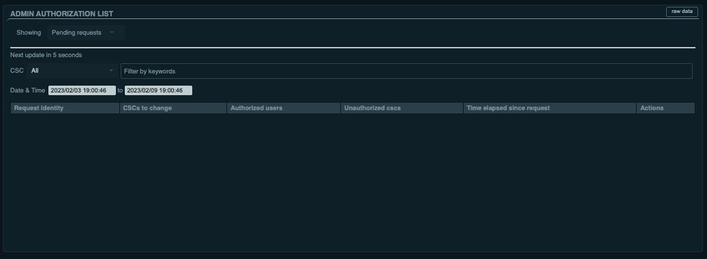

.. |author| replace:: *Tiago Ribeiro*
.. |contributors| replace:: *none*

.. _Managing-User-Authorization:

###########################
Managing User Authorization
###########################

.. note::

    Managing user authorization using LOVE is not yet fully implemented nor tested.
    This page will be updated once the functionality becomes available.

Observing specialists and other observatory system administrator-level personnel are in charge of managing :ref:`user authorization <User-Authorization>` to directly command CSCs when executing activities from :ref:`nublado <Control-System-User-Interfaces-Nublado>`.

Managing user authorization is done using LOVE's :ref:`Admin Authorization List <fig-love-admin-auth-list>` view.

    LOVE Admin Authorization List view.
    From this view observing specialists and other administrators can manage CSC authorization requests.

