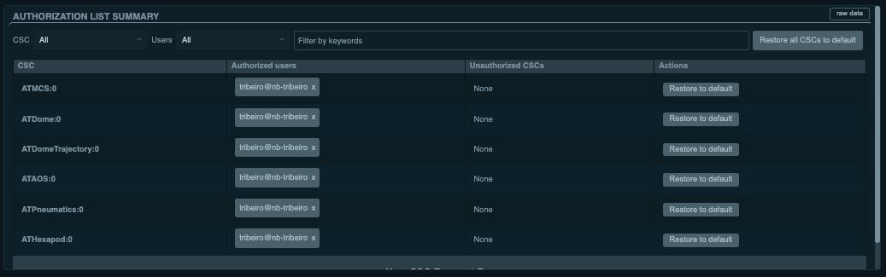

.. |author| replace:: *Tiago Ribeiro*
.. |contributors| replace:: *Wouter van Reeven*, *Rob Bovill*

.. _User-Authorization:

##################
User Authorization
##################

The Rubin Observatory Control System has an authorization system designed to help manage and coordinate user interactions with the system.

By default, the observatory is designed to perform regular survey observations under autonomous CSC control.
For example, the Scheduler will compute the observing queue and feed them to the ScriptQueue, which then executes the SAL Scripts required to observe the target.

At the same time, users may want to interact with the system to perform engineering or other tasks that require a finer level of interaction.
These activities often utilize :ref:`nublado <Control-System-User-Interfaces-Nublado>`.
Nevertheless, before they can interact with the system, they need to request authorization to directly command the CSCs.
Users can also block CSCs from interacting with other CSCs if they want to guarantee nothing else in the system will interfere with their activities.

.. note::

  The user authorization feature can be enabled/disabled at the component level.
  When disabled, some components may fail to set authorization altogether, however users will still be able to command them.

.. _User-Authorization-Prerequisites:

Prerequisites
=============

* Requesting authorization happens as part of interacting with the Observatory Control System.
  Before you start, make sure you have :ref:`announced the component usage <Operational-Tutorials-Annouce-Component-Usage>`.

* The authorization system may require an observing specialist or other administrator approval (in LOVE).
  Make sure you coordinate with the observing specialists to approve your request beforehand.

* If you are an observing specialist or administrator, see :ref:`Managing-User-Authorization`.
  

.. _User-Authorization-Post-Condition:

Post-Condition
==============

* User is authorized to control CSCs.

* The most common problems, and their respective solutions, are documented in :ref:`Troubleshooting`.

.. _User-Authorization-Tutorial-Steps:

Tutorial Steps
==============

Using High-Level Control Classes
--------------------------------

In most cases, users interact with the system using one of the high-level control classes from `ts_observatory_control`_; ``MTCS``, ``ComCam``, etc.

.. _ts_observatory_control: https://ts-observatory-control.lsst.io

These classes provides utility methods to request and release authorization for all their components.
If you are using any of the classes provided by `ts_observatory_control`_ you can request authorization by running the following command;

.. code-block:: python

  from lsst.ts import salobj
  from lsst.ts.observatory.control.maintel import MTCS

  domain = salobj.Domain()

  mtcs = MTCS(domain)

  await mtcs.start_task

  # Request authorization to operate all MTCS components
  await mtcs.request_authorization()

  # You can print the authorization status with the following command.
  # This will show who's authorized to command the CSCs in the groups or which
  # CSCs are unauthorized
  await mtcs.show_authorization()

  # If you need a stop condition, you can also assert that the user is authorized
  await mtcs.assert_authorized()

  # From now on user can operate all MTCS components...
  ...

  # Release authorization
  await mtcs.release_authorization()

When a user requests authorization to command a CSC, the information will appear in the LOVE :ref:`authorization list summary view <fig-love-auth-list-summary>`.

    LOVE authorization list summary view showing users authorized to command several CSCs.
    In general the list will be empty, which means no user is authorized to command any CSC, but CSCs can still command each other.

Individual CSCs
---------------

If you are not using the high-level control classes you can still request authorization, but you will have to handle most of the boiler plate required to format the request.
For example, the control classes have information about the components it interacts with and, therefore, can automatically produce a list of the CSCs that need requests.
They can also determine the correct user identity without the user having to know where to get it from.

The request is done via the ``Authorize`` CSC, which parses the request, handle communication with ``LOVE`` to authorize with an administrator and sets the authorizations in the CSCs.

The following is an example of how to request authorization to command the ``MTRotator`` CSC.

.. code-block:: python

  from lsst.ts import salobj

  domain = salobj.Domain()

  # As mentioned above, we need to request the authorization to the Authorize CSC
  # so we must construct a remote to send the command to it.
  authorize = salobj.Remote(domain, "Authorize")

  await authorize.start_task

  identity = domain.user_host
  timeout = 60.0

  # Request authorization to command MTRotator
  await authorize.cmd_requestAuthorization.set_start(
    cscsToChange="MTRotator",
    authorizedUsers=f"+{identity}",
    timeout=timeout
  )

  # User is now authorized to command the MTRotator CSC
  ...

  # Release authorization to command MTRotator
  await authorize.cmd_requestAuthorization.set_start(
    cscsToChange="MTRotator",
    authorizedUsers=f"-{identity}",
    timeout=timeout
  )

If you are commanding individual CSCs and need to check the authorization, use the ``authList`` event:

.. code-block:: python

  from lsst.ts import salobj

  domain = salobj.Domain()

  mtrotator = salobj.Remote(domain, "MTRotator")

  await mtrotator.start_task

  auth_list = await mtrotator.evt_authList.aget(timeout=5)

  print(auth_list.authorizedUsers)

  print(auth_list.nonAuthorizedCSCs)

.. _User-Authorization-Troubleshooting:

Troubleshooting
===============

Failure to Set Authorization
----------------------------

One common problem users may face in requesting authorization failure to set authorization by the ``Authorize`` CSC.
The error message will look like the following:
  
  AckError: msg='Command failed', ackcmd=(ackcmd private_seqNum=1003719146, ack=<SalRetCode.CMD_FAILED: -302>, error=1, result="Failed: Failed to set authList for one or more CSCs: **{'ATPtg': 'Timed out waiting for command acknowledgement'}**. The following CSCs were successfully updated: {'ATHexapod', 'ATPneumatics', 'ATDomeTrajectory', 'ATAOS', 'ATMCS', 'ATDome'}.")

The relevant information is highlighted in bold letters.
In the example above, The ``ATPtg`` component timed out replying to the set authorization command from the ``Authorize`` CSC.
In this case, this happened because authorization was not enabled in the component (as mentioned above, ).

Authorization Request Completed But Not Authorized
--------------------------------------------------

One thing to keep in mind about the interaction between the ``Authorize`` CSC and ``LOVE`` is that the CSC returns as soon as LOVE acknowledges that the request was sent to the administrator.
This does not mean the authorization was set successfully, only that the administrator should have received the request.
The authorization will only be set after the administrator approves it in the frontend.

Therefore it is important to coordinate with the administrators before starting the activity and also to confirm in the appropriate LOVE views that the authorization was correctly set.

.. _User-Authorization-Contact-Personnel:

Contact Personnel
=================

This procedure was last modified |today|.

This procedure was written by |author|.

The following are contributors: |contributors|.
